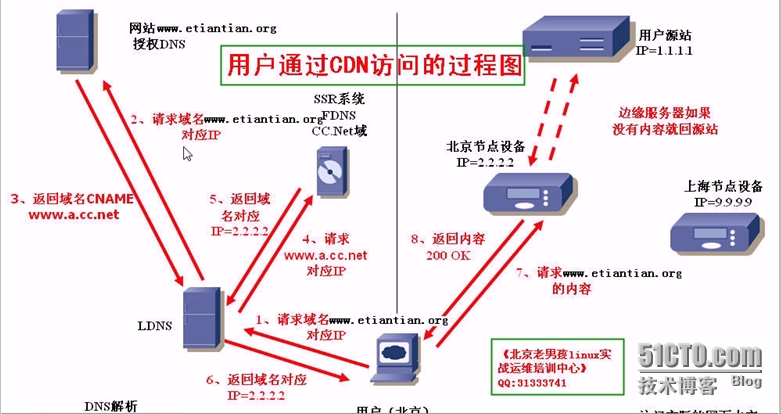

#### 网卡

把计算机内部传输的并行数据转换为适合于网络传输的串行数据； 2:把网络传输的串行数据转换为适合于计算机内部传输的并行数据

#### DNS

DNS域名系统 (Domain Name System)，它的的作用为，将域名解析为IP 地址，域名和IP地址联系在一起进行服务，这样可不必不用输入IP地址，而是通过输入网址访问网站。在DNS中可以配置A记录或者CNAME。

#### A记录

A记录是解析域名到IP

#### CNAME

CNAME是解析域名到另外一个域名。

#### LDNS

每个电脑都会配一个本地的DNS，从本地的DNS向权威DNS访问

#### FDNS

DNS服务提供商（淘宝，京东）

#### CDN

user通过CDN访问的过程：

1.用户（北京）向本地DNS请求域名www.etiantian.org对应的IP

2.LDNS没有域名etiantian.org对应IP的记录，就再去请求网站www.etiantian.org的授权DNS

3.然后授权DNS会给LDNS返回域名CNAME www.a.cc.net

4.LDNS拿到CNAME的域名www.a.cc.net并去请求FDNS下的cc.net域www.a.cc.net对应IP

5.CC.net域返回LDNS www.a.cc.net域名对应ip=2.2.2.2

6.LDNS本地缓存，并把www.a.cc.net域名对应IP=2.2.2.2返回给用户，然后用户浏览器缓存，备用、

7.用户拿到CDN边缘服务器的IP地址(北京节点设备IP=2.2.2.2)，去就近请求www.etiantian.org的内容

8.如果CDN边缘节点服务器没有用户请求的内容，节点服务器（节点服务器就是缓存服务器）就会去用户源站抓取数据

9.然后再通过CDN节点服务器把用户请求的网站数据返回给用户，200 OK，请求完成

10.用户客户端浏览器缓存，可能LDNS也会缓存用户请求到的数据，这样下次再次请求相同数据就可以直接从本地浏览器缓存去请求，如果用户手动清除了cookie，那LDNS就会找到缓存，进而可以很快就请求的自己想要的内容。

#### CPU

CPU中文名叫中央处理器(Central Processing Unit)，是一块超大规模的集成电路，是一台计算机的运算核心(Core)和控制核心( Control Unit)。它的功能主要是解释计算机指令以及处理计算机软件中的数据。CPU从存储器或高速缓冲存储器中取出指令，放入指令寄存器，并对指令译码。指令是计算机规定执行操作的类型和操作数的基本命令。指令是由一个字节或者多个字节组成，其中包括操作码字段、一个或多个有关操作数地址的字段以及一些表征机器状态的状态字以及特征码。

#### 网口

和网卡一回事

#### 路由器

路由主要功能是将由交换机组好的局域网相互连接起来，或者接入Internet

#### 交换机

交换机主要用于组建局域网

#### 网关

网关是将两个使用不同协议的网络段连接在一起的设备。

#### 子网

#### LAN口

而LAN则是Local Area Network的所写，即本地网（或叫局域网），连接内部网络

WAN口

WAN是英文Wide Area Network的首字母所写，即代表广域网，连接外部网络